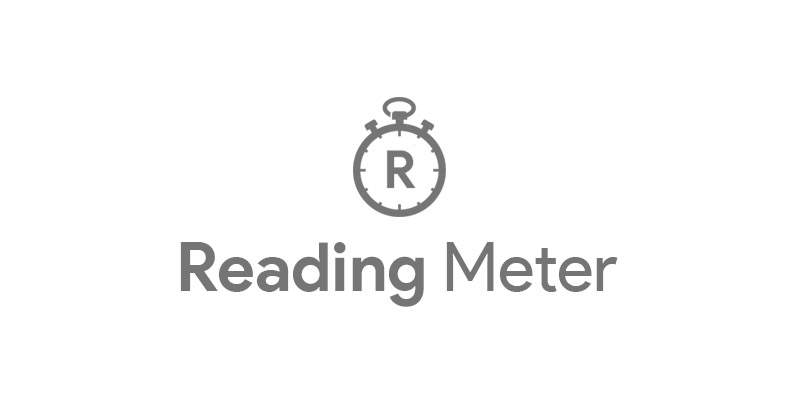
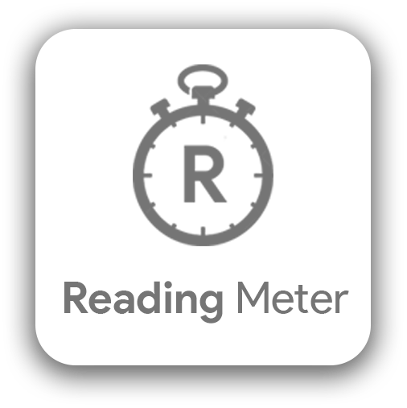
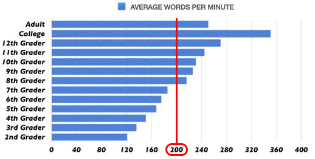

 

# Reading Meter [🔗](https://noisy96.github.io/reatime)

## Problem
Some platforms don't offer automated estimated time (not you [medium](https://www.medium.com)), you can say _but these platforms such as Facebook aren't adapted for articles_, fair enough. But they still have long posters.

## Description
__Reading Meter__ is a minimalist single purpose WebApp that estimates the time required to read a given text _(for you long posters)_.

## UI Design
### Source of inspiration
[Google Fonts](https://www.fonts.google.com) is for me one of the best websites out there for its minimalist, effecient, super sleek design. You would go there to see fonts, and that's exactly what you get, nothing else.

So no need to say, but that's where the inspiration came from.

### Components library
[Material UI](https://www.material-ui.com) 

## Technical details
- Average reading speed chosen: __200 wpm__     [1]

## Future enhancements
- Maybe giving the user more freedom to choose the average reading without spoiling the minimalistic design would be cool.

## References
- [1] [Average Words Per Minute](https://infinitemind.io/speed-reading/average-words-per-minute/)
